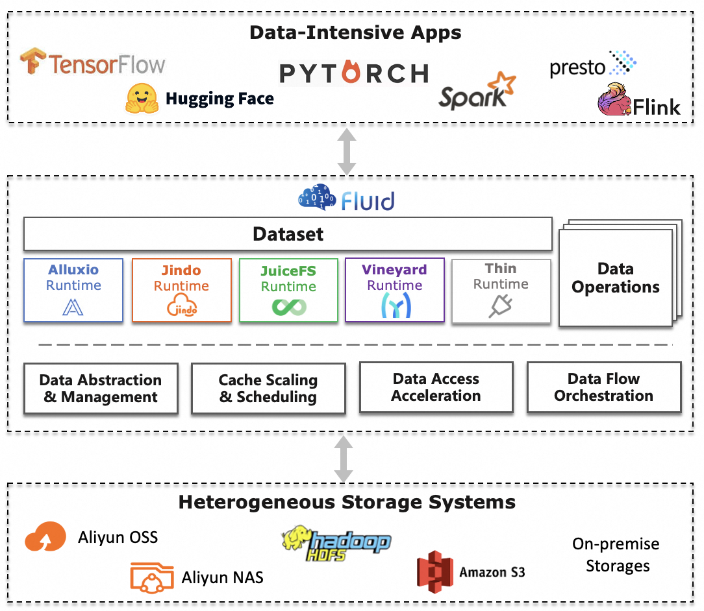

### Fluid简介

Fluid是一款开源的云原生基础架构。在计算和存储分离的大背景驱动下，Fluid的目标是为AI与大数据云原生应用提供一层高效便捷的数据抽象，将数据从存储抽象出来，以便实现：

1.  通过数据亲和性调度和分布式缓存引擎加速，实现数据和计算之间的融合，从而加速计算对数据的访问。

2.  将数据独立于存储进行管理，并且通过Kubernetes的命名空间进行资源隔离，实现数据的安全隔离。

3.  将来自不同存储的数据联合起来进行运算，从而有机会打破不同存储的差异性带来的数据孤岛效应。

### 为什么云原生需要Fluid

Fluid项目当前主要关注**数据集编排**和**应用编排**这两个重要场景。

*   数据集编排可以将指定数据集的数据缓存到指定特性的Kubernetes节点；

*   而应用编排将指定该应用调度到可以或已经存储了指定数据集的节点上。

这两者还可以组合形成协同编排场景，即协同考虑数据集和应用需求进行节点资源调度。

在云原生环境中，应用通常以**无状态（Stateless）微服务化**方式部署并不以数据处理为中心；而数据密集型框架和应用通常以数据抽象为中心，开展相关计算作业和任务的分配执行。当数据密集型框架融入云原生环境后，也需要像Fluid这样以数据抽象为中心的调度和分配框架来协同。

针对当前Kubernetes缺乏对应用数据的感知和优化，以及像Alluxio这样的数据编排引擎难以直接驱动云原生应用等架构层的局限，Fluid提出将数据应用协同编排、智能感知、联合优化等一系列创新方法，并且基于Alluxio形成一套云原生场景下数据密集型应用的高效支撑平台。

具体的架构参见下图：

### Fluid的几个核心概念

**Dataset**: 数据集是逻辑上相关的一组数据的集合，会被运算引擎使用，比如大数据的Spark，AI场景的TensorFlow。而这些数据智能的应用会创造工业界的核心价值。Dataset的管理实际上也有多个维度，比如安全性，版本管理和数据加速。我们希望从数据加速出发，对于数据集的管理提供支持。

**Runtime**: 实现数据集安全性，版本管理和数据加速等能力的执行引擎，定义了一系列生命周期的接口。可以通过实现这些接口，支持数据集的管理和加速。

**AlluxioRuntime**: 支撑Dataset数据管理和缓存的执行引擎实现。Fluid通过管理和调度Alluxio Runtime实现数据集的可见性，弹性伸缩， 数据迁移。

### Fluid的核心组件

#### 控制器(Fluid-controller-manager)

从逻辑上，每个控制器都是单独的进程，为了降低复杂性，它们都被编译到同一个可执行文件，并在一个进程中运行。

这些控制器包括：

*   **Dataset Controller**: 负责Dataset的生命周期管理，包括创建，与Runtime的绑定和解绑，删除。

*   **Runtime Controller**: 负责Runtime的生命周期管理，包括创建，扩缩容，缓存预热和清理的触发，删除等操作。

*   **Volume Controller**: 负责Dataset对应的数据卷的创建，删除。

#### 调度器(Fluid-scheduler)

负责在调度过程，结合数据缓存的信息，选择符合条件的节点。

*   **Cache co-locality Plugin**: 结合Runtime中的数据缓存信息，对于使用数据集的应用进行调度。无需用户指定缓存节点。

*   **Prefetch Plugin**: 在调度过程中，根据应用使用数据的特性触发Runtime进行数据预热。

### Fluid快速安装

#### 前提条件

*   Git

*   Kubernetes集群（version >\= 1.18）, 并且支持CSI功能

*   kubectl（version >\= 1.18）

*   Helm（version >\= 3.5）

#### 获取Fluid Chart

您可以从[Fluid Releases](https://github.com/fluid-cloudnative/fluid/releases)下载最新的Fluid安装包。

#### 使用Helm安装Fluid

创建命名空间：

    $ kubectl create ns fluid-system

为本地Helm仓库添加并且更新“fluid”源到最新版本

    $ helm repo add fluid https://fluid-cloudnative.github.io/charts
    $ helm repo update

安装Fluid：

    $ helm install fluid fluid/fluid
    NAME: fluid
    LAST DEPLOYED: Wed May 24 18:17:16 2023
    NAMESPACE: default
    STATUS: deployed
    REVISION: 1
    TEST SUITE: None

> 对于Kubernetes v1.17及以下环境，请使用`helm install --set runtime.criticalFusePod=false fluid fluid.tgz`

> `helm install`命令的一般格式是`helm install <RELEASE_NAME> <SOURCE>`，在上面的命令中，第一个`fluid`指定了安装的release名字，这可以自行更改，第二个`fluid.tgz`指定了helm chart所在路径。

#### 使用Helm将Fluid更新到最新版本

如果您此前已经安装过旧版本的Fluid，可以使用Helm进行更新。 更新前，建议确保各Runtime资源对象中的各个组件已经顺利启动完成，也就是类似以下状态：

    $ kubectl get pod
    NAME                 READY   STATUS    RESTARTS   AGE
    hbase-fuse-chscz     1/1     Running   0          9h
    hbase-fuse-fmhr5     1/1     Running   0          9h
    hbase-master-0       2/2     Running   0          9h
    hbase-worker-bdbjg   2/2     Running   0          9h
    hbase-worker-rznd5   2/2     Running   0          9h

更新：

    $ helm upgrade fluid fluid/fluid
    Release "fluid" has been upgraded. Happy Helming!
    NAME: fluid
    LAST DEPLOYED: Wed May 24 18:27:54 2023
    NAMESPACE: default
    STATUS: deployed
    REVISION: 2
    TEST SUITE: None

> 对于Kubernetes v1.17及以下环境，请使用`helm upgrade --set runtime.criticalFusePod=false fluid fluid/`

> 建议您从v0.7升级到最新版本。如果您安装的是更旧版本的Fluid，建议重新进行安装。

#### 检查各组件状态

**查看Fluid使用的CRD:**

    $ kubectl get crd | grep data.fluid.io
    alluxioruntimes.data.fluid.io                          2023-05-24T10:14:47Z
    databackups.data.fluid.io                              2023-05-24T10:14:47Z
    dataloads.data.fluid.io                                2023-05-24T10:14:47Z
    datamigrates.data.fluid.io                             2023-05-24T10:28:11Z
    datasets.data.fluid.io                                 2023-05-24T10:14:47Z
    efcruntimes.data.fluid.io                              2023-05-24T10:28:12Z
    goosefsruntimes.data.fluid.io                          2023-05-24T10:14:47Z
    jindoruntimes.data.fluid.io                            2023-05-24T10:14:48Z
    juicefsruntimes.data.fluid.io                          2023-05-24T10:14:48Z
    thinruntimeprofiles.data.fluid.io                      2023-05-24T10:28:16Z
    thinruntimes.data.fluid.io                             2023-05-24T10:28:16Z

**查看各Pod的状态:**

    $ kubectl get pod -n fluid-system
    NAME                                     READY   STATUS      RESTARTS   AGE
    csi-nodeplugin-fluid-2scs9               2/2     Running     0          50s
    csi-nodeplugin-fluid-7vflb               2/2     Running     0          20s
    csi-nodeplugin-fluid-f9xfv               2/2     Running     0          33s
    dataset-controller-686d9d9cd6-gk6m6      1/1     Running     0          50s
    fluid-crds-upgrade-1.0.0-37e17c6-fp4mm   0/1     Completed   0          74s
    fluid-webhook-5bc9dfb9d8-hdvhk           1/1     Running     0          50s
    fluidapp-controller-6d4cbdcd88-z7l4c     1/1     Running     0          50s

如果Pod状态如上所示，那么Fluid就可以正常使用了！