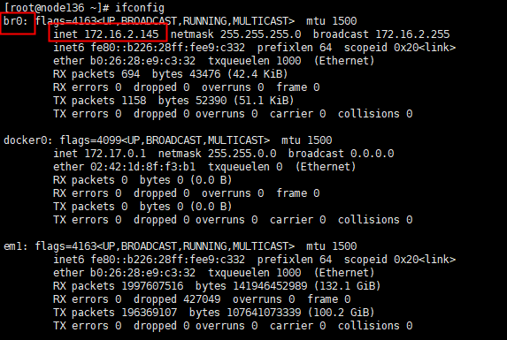

# 云原生环境搭建合集

## 一、物理节点虚拟化

### 1、虚拟系统拷贝部署

虚拟节点数

```
centos1
node2
node3
```

将`/data1/kvm-files/centos1.qcow2`文件拷贝三份

```shell
$ cd /data1/kvm-files
$ ll
centos1.qcow2
node2.qcow2
node3.qcow2
```

执行命令，初始化并运行虚拟机

需要提前安装`virt-install`命令

```
yum install libvirt-daemon-kvm qemu-kvm virt-install
```


### 2、设置br0网桥

1、安装必要的依赖包

```
yum install bridge-utils
```

2、新增/etc/sysconfig/network-scripts/ifcfg-br0文件：

```
BOOTPROTO=static
DEVICE=br0
TYPE=Bridge
#设置一个可用的静态ip
IPADDR=172.16.2.145 
ONBOOT=yes
NETMASK=255.255.255.0
GATEWAY=172.16.2.1
DNS1=172.16.2.246
DNS2=172.16.1.207
```

3、编辑/etc/sysconfig/network-scripts/ifcfg-em1的网卡配置文件

```
#新增该行
BRIDGE=br0 
```

4、重启网络服务

```
systemctl restart network.service
```



### 3、从镜像创建虚拟机

创建虚拟机磁盘

```
qemu-img create -f qcow2 ./centos1.qcow2 300G
```

创建虚拟机

```
virt-install -n centos1 -r 20480 --vcpus 8 --disk ./vir_disk/centos1.qcow2 --location ./CentOS-7-x86_64-DVD-2009.iso --nographics --network bridge=br0 --os-type linux --os-variant rhel7 --console pty,target_type=serial --extra-args 'console=ttyS0,115200n8 serial'
```


### 4、启动虚拟机

```shell
# 初始化centos1,8核16g
$ virt-install -n centos1 -r 16384 --vcpus 8 --disk /data2/kvm-files/centos1.qcow2 --nographics --network bridge=br0 --boot hd --virt-type kvm --noautoconsole --autostart

# 初始化node2,8核16g
$ virt-install -n node2 -r 16384 --vcpus 8 --disk /data2/kvm-files/node2.qcow2 --nographics --network bridge=br0 --boot hd --virt-type kvm --noautoconsole --autostart

# 初始化node3,8核16g
$ virt-install -n node3 -r 16384 --vcpus 8 --disk /data2/kvm-files/node3.qcow2 --nographics --network bridge=br0 --boot hd --virt-type kvm --noautoconsole --autostart
```

虚拟机操作命令

以centos1为例

```shell
# 启动
$ virsh start centos1
# 停止
$ virsh shutdown centos1
# 重启
$ virsh reboot centos1
# 进入命令行
$ virsh console centos1
```

设置hostname和ip

```shell
$ vim /etc/sysconfig/network-scripts/ifcfg-ens3
# 修改UUID和IPADDR，每个虚拟机不能相同

$ hostnamectl set-hostname centos1
$ hostnamectl set-hostname node2
$ hostnamectl set-hostname node3
```

设置/etc/hosts

```
在每个节点的/etc/hosts中，设置其他节点的ip 和 hostname
```

重启虚拟机

```shell
$ reboot
```

卸载虚拟机

```shell
$ virsh destroy centos1
$ virsh undefine centos1
```


## 二、在裸机上安装KubeSphere

### 1、安装必要依赖

每个节点，安装k8s必要依赖（需要修改yum源）

```properties
[base]
name=CentOS-$releasever - Base - mirrors.aliyun.com
failovermethod=priority
baseurl=http://mirrors.aliyun.com/centos/$releasever/os/$basearch/
        http://mirrors.aliyuncs.com/centos/$releasever/os/$basearch/
        http://mirrors.cloud.aliyuncs.com/centos/$releasever/os/$basearch/
gpgcheck=1
gpgkey=http://mirrors.aliyun.com/centos/RPM-GPG-KEY-CentOS-7

#released updates 
[updates]
name=CentOS-$releasever - Updates - mirrors.aliyun.com
failovermethod=priority
baseurl=http://mirrors.aliyun.com/centos/$releasever/updates/$basearch/
        http://mirrors.aliyuncs.com/centos/$releasever/updates/$basearch/
        http://mirrors.cloud.aliyuncs.com/centos/$releasever/updates/$basearch/
gpgcheck=1
gpgkey=http://mirrors.aliyun.com/centos/RPM-GPG-KEY-CentOS-7

#additional packages that may be useful
[extras]
name=CentOS-$releasever - Extras - mirrors.aliyun.com
failovermethod=priority
baseurl=http://mirrors.aliyun.com/centos/$releasever/extras/$basearch/
        http://mirrors.aliyuncs.com/centos/$releasever/extras/$basearch/
        http://mirrors.cloud.aliyuncs.com/centos/$releasever/extras/$basearch/
gpgcheck=1
gpgkey=http://mirrors.aliyun.com/centos/RPM-GPG-KEY-CentOS-7

#additional packages that extend functionality of existing packages
[centosplus]
name=CentOS-$releasever - Plus - mirrors.aliyun.com
failovermethod=priority
baseurl=http://mirrors.aliyun.com/centos/$releasever/centosplus/$basearch/
        http://mirrors.aliyuncs.com/centos/$releasever/centosplus/$basearch/
        http://mirrors.cloud.aliyuncs.com/centos/$releasever/centosplus/$basearch/
gpgcheck=1
enabled=0
gpgkey=http://mirrors.aliyun.com/centos/RPM-GPG-KEY-CentOS-7

#contrib - packages by Centos Users
[contrib]
name=CentOS-$releasever - Contrib - mirrors.aliyun.com
failovermethod=priority
baseurl=http://mirrors.aliyun.com/centos/$releasever/contrib/$basearch/
        http://mirrors.aliyuncs.com/centos/$releasever/contrib/$basearch/
        http://mirrors.cloud.aliyuncs.com/centos/$releasever/contrib/$basearch/
gpgcheck=1
enabled=0
gpgkey=http://mirrors.aliyun.com/centos/RPM-GPG-KEY-CentOS-7
```


```shell
yum install -y socat conntrack ebtables ipset
```

### 2、下载kubekey

主节点操作

```shell
export KKZONE=cn
curl -sfL https://get-kk.kubesphere.io | VERSION=v3.0.13 sh -
```

备注：在您下载 KubeKey 后，如果您将其传至新的机器，且访问 Googleapis 同样受限，在您执行以下步骤之前请务必再次执行 `export KKZONE=cn` 命令。

```shell
chmod +x kk
```

### 3、创建多节点多节点集群

```shell
./kk create config --with-kubernetes v1.24.12 --with-kubesphere v3.4.1
```

```shell
//编辑文件修改集群节点信息
vim config-sample.yaml
```

```shell
./kk create cluster -f config-sample.yaml
```

### 4、验证安装

安装结束后，您可以执行以下命令查看安装日志

```shell
kubectl logs -n kubesphere-system $(kubectl get pod -n kubesphere-system -l 'app in (ks-install, ks-installer)' -o jsonpath='{.items[0].metadata.name}') -f
```

如果返回欢迎日志，则安装成功

```shell
**************************************************

#####################################################

###              Welcome to KubeSphere!           ###

#####################################################

Console: http://192.168.60.152:30880

Account: admin

Password: P@88w0rd

NOTES：

  1. After you log into the console, please check the

     monitoring status of service components in

     the "Cluster Management". If any service is not

     ready, please wait patiently until all components

     are up and running.

  2. Please change the default password after login.

#####################################################

https://kubesphere.io             20xx-xx-xx xx:xx:xx

#####################################################

```

### 5、报错解决

#### 问题

```shell
task monitoring status is failed  (4/4)
**************************************************
Collecting installation results ...


Task 'monitoring' failed:
******************************************************************************************************************************************************
{
  "counter": 148,
  "created": "2024-08-26T08:11:51.096367",
  "end_line": 141,
  "event": "runner_on_failed",
  "event_data": {
    "duration": 960.085854,
    "end": "2024-08-26T08:11:51.095665",
    "event_loop": null,
    "host": "localhost",
    "ignore_errors": null,
    "play": "localhost",
    "play_pattern": "localhost",
    "play_uuid": "7aa8de44-2576-d896-b863-000000000005",
    "playbook": "/kubesphere/playbooks/monitoring.yaml",
    "playbook_uuid": "a5eab72c-3cb3-46db-85eb-741c5b86e6c5",
    "remote_addr": "127.0.0.1",
    "res": {
      "_ansible_no_log": false,
      "attempts": 3,
      "changed": true,
      "cmd": "/usr/local/bin/helm upgrade --install notification-manager /kubesphere/kubesphere/notification-manager -f /kubesphere/kubesphere/notification-manager/custom-values-notification.yaml -n kubesphere-monitoring-system --force\n",
      "delta": "0:05:07.063456",
      "end": "2024-08-26 16:11:51.043560",
      "invocation": {
        "module_args": {
          "_raw_params": "/usr/local/bin/helm upgrade --install notification-manager /kubesphere/kubesphere/notification-manager -f /kubesphere/kubesphere/notification-manager/custom-values-notification.yaml -n kubesphere-monitoring-system --force\n",
          "_uses_shell": true,
          "argv": null,
          "chdir": null,
          "creates": null,
          "executable": null,
          "removes": null,
          "stdin": null,
          "stdin_add_newline": true,
          "strip_empty_ends": true,
          "warn": true
        }
      },
      "msg": "non-zero return code",
      "rc": 1,
      "start": "2024-08-26 16:06:43.980104",
      "stderr": "Error: UPGRADE FAILED: post-upgrade hooks failed: timed out waiting for the condition",
      "stderr_lines": [
        "Error: UPGRADE FAILED: post-upgrade hooks failed: timed out waiting for the condition"
      ],
      "stdout": "",
      "stdout_lines": []
    },
    "resolved_action": "command",
    "role": "ks-monitor",
    "start": "2024-08-26T07:55:51.009811",
    "task": "notification-manager | Deploying notification-manager",
    "task_action": "command",
    "task_args": "",
    "task_path": "/kubesphere/installer/roles/ks-monitor/tasks/notification-manager.yaml:30",
    "task_uuid": "7aa8de44-2576-d896-b863-00000000005a",
    "uuid": "9b92191f-a321-4d6e-84d2-fd69d315fc00"
  },
  "parent_uuid": "7aa8de44-2576-d896-b863-00000000005a",
  "pid": 6230,
  "runner_ident": "monitoring",
  "start_line": 140,
  "stdout": "fatal: [localhost]: FAILED! => {\"attempts\": 3, \"changed\": true, \"cmd\": \"/usr/local/bin/helm upgrade --install notification-manager /kubesphere/kubesphere/notification-manager -f /kubesphere/kubesphere/notification-manager/custom-values-notification.yaml -n kubesphere-monitoring-system --force\\n\", \"delta\": \"0:05:07.063456\", \"end\": \"2024-08-26 16:11:51.043560\", \"msg\": \"non-zero return code\", \"rc\": 1, \"start\": \"2024-08-26 16:06:43.980104\", \"stderr\": \"Error: UPGRADE FAILED: post-upgrade hooks failed: timed out waiting for the condition\", \"stderr_lines\": [\"Error: UPGRADE FAILED: post-upgrade hooks failed: timed out waiting for the condition\"], \"stdout\": \"\", \"stdout_lines\": []}",
  "uuid": "9b92191f-a321-4d6e-84d2-fd69d315fc00"
}
******************************************************************************************************************************************************
Failed to ansible-playbook result-info.yaml
```

#### 解决

```
# k8s集群所有节点都需要操作
vim /etc/containerd/config.toml

# 将docker的镜像代理地址改为公司的镜像代理地址
# https://hub-mirror.jshcbd.com.cn
```


```
systemctl daemon-reload
systemctl restart containerd
```

### 6、设置master节点允许调度worker

```shell
# 查看，如果输出为 Taints:<none>，则不需要设置第二步
$ kubectl describe nodes centos1 | grep Taints
# 将master节点的worker设置为可调度
$ kubectl taint nodes <hostname> node-role.kubernetes.io/control-plane:NoSchedule-
```

### 7、ImagePullBackOff镜像检查和重新安装

```shell
# 检查k8s部署的pod是否状态正常
$ kubectl get pods -A 

# 删除ImagePullBackOff状态的pod，比如：
$ kubectl -n kube-system delete pod snapshot-controller-0
```

### 7、卸载

如需删除集群，请执行以下命令。

```shell
./kk delete cluster
```

### 登录控制台

```shell
# 根据master节点ip
Console: http://192.168.60.152:30880
Account: admin
Password: P@88w0rd
```

### 优化系统

- 更新系统。

  ```shell
  yum update
  ```

- 添加所需的内核引导参数。

  ```shell
  sudo /sbin/grubby --update-kernel=ALL --args='cgroup_enable=memory cgroup.memory=nokmem swapaccount=1'
  ```

- 启用 `overlay2` 内核模块。

  ```shell
  echo "overlay2" | sudo tee -a /etc/modules-load.d/overlay.conf
  ```

- 刷新动态生成的 grub2 配置。

  ```shell
  sudo grub2-set-default 0
  ```

- 调整内核参数并使修改生效。

  ```shell
  cat <<EOF | sudo tee -a /etc/sysctl.conf
  vm.max_map_count = 262144
  fs.may_detach_mounts = 1
  net.ipv4.ip_forward = 1
  vm.swappiness=1
  kernel.pid_max =1000000
  fs.inotify.max_user_instances=524288
  EOF
  sudo sysctl -p
  ```

- 调整系统限制。

  ```shell
  vim /etc/security/limits.conf
  *                soft    nofile         1024000
  *                hard    nofile         1024000
  *                soft    memlock        unlimited
  *                hard    memlock        unlimited
  root             soft    nofile         1024000
  root             hard    nofile         1024000
  root             soft    memlock        unlimited
  ```

- 删除旧的限制配置。

  ```shell
  sudo rm /etc/security/limits.d/20-nproc.conf
  ```

- 重启系统。

  ```shell
  reboot
  ```

## 三、LongHorn安装

### 1、要求

```
helm > v3.0
```

### 2、安装

对于 Kubernetes < v1.25，如果你的集群仍然启用 Pod Security Policy admission controller，请将 helm 值 `enablePSP` 设置为 `true`，以安装 `longhorn-psp` PodSecurityPolicy允许特权 Longhorn Pod 启动。

```shell
$ helm repo add longhorn https://charts.longhorn.io
$ helm repo update
```

修改longhorn的配置，可以通过helm pull下载tgz包后解压获得values.yaml文件，cp到更目录平级目录，然后修改配置

或者从github下载 values.yaml，并修改配置

```shell
$ helm pull longhorn/longhorn
$ tar -zxvf longhorn-1.7.0.tgz

$ curl -Lo values.yaml https://raw.githubusercontent.com/longhorn/charts/master/charts/longhorn/values.yaml
```

```shell
$ helm install longhorn longhorn/longhorn --namespace longhorn-system --create-namespace --version 1.7.0
```

```shell
# get pod确认部署成功
$ kubectl -n longhorn-system get pod
```

卸载

```shell
$ kubectl -n longhorn-system patch -p '{"value": "true"}' --type=merge lhs deleting-confirmation-flag
$ helm uninstall longhorn -n longhorn-system
```

### 3、Longhorn UI

```shell
$ kubectl -n longhorn-system get svc
$ kubectl -n longhorn-system edit svc longhorn-frontend
# spec.type: ClusterIP 改为 spec.type: NodePort
```
